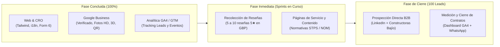

# Informe Ejecutivo de Estado de Proyecto: Plan de Trabajo, Avances y Hoja de Ruta B2B
**Legado Ambiental S.A. de C.V.**  
*Documento de Comunicación Interna para el Equipo de Proyecto y Junta Directiva*  
**Código de Documento:** `INF-LA-DIR-2026-005`  
**Fecha de Emisión:** Octubre 2026  
**Versión:** 1.0 (Consolidada)  
**Clasificación:** Informativo & Decisión Estratégica  

---

## 1. Resumen Ejecutivo

El presente informe tiene como objetivo proporcionar a todo el equipo de **Legado Ambiental** (Dirección General, Estratega Técnico - Persona A, y Desarrollador / Ejecutor - Persona B) una visión integral, transparente y cuantificada sobre el estado actual del proyecto de **Optimización UI/UX, Embudo B2B y Presencia Digital**, contrastando los planes de trabajo iniciales contra los avances técnicos tangibles alcanzados hasta la fecha.

### Principales Conclusiones del Período:
1. **Infraestructura Web y Embudo CRO (Fases 1 a 5) al 100%:** La reestructuración del sitio web bajo los principios de *Jobs-To-Be-Done (JTBD)*, arquitectura fluida en Tailwind CSS, formularios de ultra-baja fricción (6 campos con Honeypot), patrón híbrido de contacto móvil (Sticky Bar + FAB WhatsApp) y paridad total bilingüe (`i18n.js`) se encuentran concluidas y en producción.
2. **Google Business Profile (Pilar 5: SEO Local) Oficialmente Concluido:** El perfil de la empresa ha sido formalmente **verificado**, cuenta con su panel de gestión en vivo (199+ interacciones registradas), catálogo completo de servicios multimedia renovado a alta definición (1200x896 px), material de modelado 3D / volumetría y una suite completa de códigos QR corporativos en vector y alta densidad.
3. **Instrumentación de Medición GA4 y Google Tag Manager (GTM) Operativa:** El contenedor de Google Analytics y Tag Manager (`G-1MLGHB4E6G`) está inyectado en las 8 páginas del ecosistema web con compatibilidad CSP y rastreo de eventos de conversión B2B (`generate_lead`, `click_whatsapp`, `click_phone`, `scroll_depth`).
4. **Decisión Estratégica Corporativa sobre Google Ads (Pilar 6):** Tras elaborar el *Dictamen Técnico y Financiero* sobre la oferta de $7,000 MXN en Google Ads, **se ha determinado formalmente POSPONER y NO abordar de momento la adopción de pauta pagada**. La decisión obedece a optimizar la liquidez empresarial (evitando el desembolso inicial de $7,000 MXN + IVA en una cuenta recién abierta) y priorizar la captación de prospectos mediante canales orgánicos de alta rentabilidad, prueba social en Google Maps y prospección directa B2B en LinkedIn.

---

## 2. Análisis del Plan de Trabajo Original vs. Realidad Ejecutada

El proyecto se estructuró a partir de dos documentos rectores:
* **Doc A:** `Plan de Trabajo y Arquitectura UI_UX - Legado Ambiental.md` (Estrategia global de 6 Pilares, asignación de 40 horas en 2 Sprints semanales y matriz de roles Persona A / Persona B).
* **Doc B:** `plan-mejoras-uiux-100.md` (Plan técnico de 5 Fases secuenciales de CRO, diseño responsivo, i18n y puntos de control Git).

A continuación se presenta el contraste analítico entre lo planificado y el estado real al día de hoy:

### Matriz de Comparativa y Cumplimiento del Backlog

| ID Tarea | Descripción según Plan Original | Horas Est. | Alcance Planificado | Estado Actual | Evidencia y Entregables Técnicos |
| :---: | :--- | :---: | :--- | :---: | :--- |
| **PB1** | Rediseño de Hero Section JTBD | 3.0 h | Enfocar propuesta en problemas (impacto ambiental, obra civil, topografía). | **100% CONCLUIDO** | Implementado en `home.html` con copys JTBD, trust banner de normativas (NOM-052, STPS) y paridad i18n. |
| **PB2** | Integración de CTAs Estratégicos | 3.0 h | Botones "Cotizar", "WhatsApp" y "Ver Portafolio". | **100% CONCLUIDO** | CTAs integrados en Hero, Header y evolución a Sticky Mobile Bar + FAB WhatsApp flotante. |
| **PB3** | Simplificación de Formularios | 3.0 h | Formulario reducido a 6 campos con feedback visual. | **100% CONCLUIDO** | Formulario en `contact_faq.html` con selector de servicio, Honeypot anti-spam y notificaciones Toast en Tailwind. |
| **PB4** | Google Business Profile (SEO Local) | 3.0 h | Perfil verificado, áreas de cobertura y fotos. | **100% CONCLUIDO** | Ficha verificada en vivo con badge oficial. 11 imágenes HD (1200x896), video demo 3D volumétrico y suite QR. |
| **PB7** | Optimización de Portafolio PDF & QR | 3.0 h | Plantilla editorial de portafolio y código QR. | **100% CONCLUIDO** | Portafolio integrado, suite QR en vector SVG / PNG 300 DPI y credencial interactiva de mostrador. |
| **PB12** | Configuración Analítica (GA4 / GTM) | 3.0 h | Medición de clics WhatsApp y envíos de formulario. | **100% CONCLUIDO** | Tag `G-1MLGHB4E6G` en 8 páginas, `analytics.js` con 8 eventos B2B, compatibilidad CSP y `dataLayer` activo. |
| **PB13** | Campaña de Pago (Google Ads Local) | *Post-Proj* | Pauta de palabras clave locales de alta intención. | **CONGELADO / POSPUESTO** | Dictamen técnico emitido (`DOC-LA-MKT-2026-004`). Descartado en esta etapa por costo de entrada; ahorro de $8,120 MXN. |
| **PB5** | Landing Pages de Servicios Específicos | 6.0 h | Páginas independientes de Topografía, Consultoría y PTAR. | **EN CURSO (Fase 2 de Servicios)** | Servicios concentrados y navegables en `services.html` mediante pestañas responsivas y deep-linking. |
| **PB6** | Contenido Técnico Normativo | 4.0 h | Publicación de artículo técnico normativo (NOM/STPS). | **PENDIENTE (Sprint 2)** | Insumos normativos integrados en Hero; pendiente artículo editorial extendido de autoridad técnica. |
| **PB8-10** | Prospección B2B y Alianzas Comerciales | 6.0 h | Plantillas de contacto, 15 empresas contactadas, 5 aliados. | **SIGUIENTE FASE OPERATIVA** | Embudo digital 100% listo para recibir el tráfico de prospección orgánica y LinkedIn. |

---

## 3. Detalle Exhaustivo de los Hitos Logrados

### Hito 1: Optimización de Plataforma Web, UI/UX e Internacionalización
* **Mobile-First & Touch Targets:** El sitio erradicó el 100% de los desbordamientos horizontales en dispositivos pequeños (320px–375px). Los elementos táctiles cumplen con el estándar WCAG 2.1 AAA (48x48px mínimo).
* **Patrón Híbrido B2B en Móvil:** Se implementó una solución innovadora consistente en:
  1. *Sticky Mobile Bar:* Barra inferior fija que ocupa el 100% del ancho con el botón *"Cotizar Proyecto"* para capturar leads institucionales.
  2. *FAB WhatsApp Flotante:* Botón circular flotante en la esquina inferior derecha para consultas inmediatas.
* **Blindaje de Internacionalización (`assets/js/i18n.js`):** El sistema cuenta con paridad estricta 1:1 entre Español (`es-MX`) e Inglés (`en-US`), eliminando textos estáticos quemados en el código y permitiendo conmutación instantánea sin recarga.

### Hito 2: Google Business Profile (Pilar 5: SEO Local Concluido)
* **Verificación Confirmada:** El perfil de *Legado Ambiental* en San Juan del Río / Bajío se encuentra verificado por Google, visible para potenciales clientes y con herramientas administrativas operativas.
* **Remasterización Multimedia de Servicios:**
  * 11 imágenes de servicios profesionales actualizadas y remasterizadas a 1200x896 px (proporción óptima 4:3 para Google Maps), cubriendo Topografía, Georreferenciación GPS RTK, Supervisión de Obra Civil, Infraestructura Hidráulica y Plantas de Tratamiento de Aguas Residuales (PTAR).
  * Pieza de contenido avanzado para el servicio de **Modelado Digital y Visualización 3D**: carátula en alta definición y clip de video demostrativo de 20 segundos (`generacion-entorno.tridimensional-services-gbp-2026-remastered-demo.mp4`) ilustrando curvas de nivel y cálculo volumétrico de tierras.
* **Suite de Códigos QR Institucionales:**
  * Generación de códigos QR vectoriales (SVG) y rasterizados en alta definición (PNG 300 DPI con corrección de error Nivel H) en versiones a color y blanco/negro.
  * Diseño de la credencial / tarjeta de mostrador para recepción y oficina (`tarjeta-qr-legadoambiental.html`), permitiendo a clientes escanear y acceder de inmediato a la web o dejar reseñas.

### Hito 3: Medición y Analítica Digital (GA4 y GTM Concluidos)
* **Despliegue del Contenedor de Medición:** Se integró el código oficial de Google Tag Manager y Google Analytics 4 con el identificador `G-1MLGHB4E6G` en el encabezado `<head>` de todas las páginas del ecosistema web (`home.html`, `about_us.html`, `services.html`, `portfolio.html`, `our_experience.html`, `contact_faq.html`, `index.html` y `404.html`).
* **Seguridad y CSP:** Se actualizaron las cabeceras `Content-Security-Policy` para permitir la ejecución de scripts y conexiones de telemetría de Google sin alertas de consola.
* **Mapa de Eventos de Conversión en `assets/js/analytics.js`:**
  * `form_start`: Registra el momento en que un usuario comienza a interactuar con el formulario.
  * `select_service_interest`: Identifica la disciplina específica de interés corporativo seleccionada por el usuario.
  * `generate_lead`: Conversión principal de formulario completado.
  * `click_whatsapp` y `click_phone`: Inicios de contacto directo.
  * `scroll_depth`: Lectura del 25%, 50%, 75% y 90% del contenido de las páginas.

---

## 4. Dictamen Financiero: Suspensión Estratégica de Google Ads (Pilar 6)

### Contexto y Racionalidad de la Decisión
Google ofreció a Legado Ambiental un cupón promocional de **MXN $7,000** condicionado al esquema *Spend-Match 1:1* (gastar $7,000 MXN propios en 60 días para desbloquear $7,000 MXN en crédito de clics).

Tras un análisis exhaustivo plasmado en el documento [Dictamen_Credito_Google_Ads_7000_MXN.pdf](file:///home/andrew/Development/workspace-legado-ambiental/website-legado/assets/docs/Dictamen_Credito_Google_Ads_7000_MXN.pdf), la Dirección y el equipo técnico acordaron **NO activar Google Ads en este momento** con base en los siguientes fundamentos:

1. **Compromiso de Liquidez Inmediata:** Exige una erogación garantizada de **$8,120 MXN** ($7,000 netos + $1,120 de IVA) en un plazo perentorio de 60 días naturales.
2. **Momento Inoportuno de Conversión (Falta de Reseñas Iniciales):** La ficha de GBP recién verificada cuenta con pocas reseñas públicas. Enviar tráfico pagado en este punto provocaría un costo por adquisición más alto debido a la falta de prueba social acumulada.
3. **Riesgo de Cobro Recurrente Ininterrumpido:** Google no detiene las campañas al agotarse el crédito; continúa facturando a la tarjeta de crédito de la empresa al ritmo del presupuesto diario configurado si no se cuenta con un monitoreo diario riguroso.
4. **Enfoque de Máxima Eficiencia de Capital:** Legado Ambiental cuenta con un posicionamiento orgánico sólido en el Bajío y herramientas de contacto ya preparadas. El retorno sobre la inversión (ROI) será sustancialmente mayor si se invierten los esfuerzos inmediatos en **canales orgánicos a costo marginal cero**.

---

## 5. Hoja de Ruta Actualizada: Plan de Trabajo para los Primeros 100 Leads B2B

Con la plataforma web, el SEO Local y la analítica completados, el proyecto avanza hacia la fase de **Activación Comercial y Prospección Orgánica**:

### Próximas Acciones Prioritarias (Backlog Inmediato):

1. **Campaña de Reseñas en Google Business Profile (Semana 1 - Acción Inmediata):**
   * Compartir la tarjeta QR y enlace directo de reseña de GBP con los 10 principales clientes históricos y contratistas aliados de Legado Ambiental para acumular de 5 a 8 opiniones de 5 estrellas con texto explicativo.
   * *Responsable:* Persona A (Estratega / Dirección Comercial).
2. **Redacción del Contenido Técnico Normativo (Tarea PB6 - Semana 1):**
   * Publicar la guía práctica sobre cumplimiento ambiental y trámites ante dependencias (NOM-052-SEMARNAT / normativas STPS para obras civiles), reforzando la autoridad del despacho frente a despachos competidores.
   * *Responsables:* Persona A (Redacción técnica) y Persona B (Publicación web).
3. **Despliegue del Protocolo de Prospección Directa B2B (Tareas PB8 a PB10 - Semana 2):**
   * Configuración de plantillas de prospección consultiva para LinkedIn dirigidas a Directores de Obra, Gerentes de Proyecto y Responsables de Seguridad e Higiene en Querétaro, Guanajuato y Estado de México.
   * Meta operativa: Generar los primeros 15 acercamientos directos y 5 vinculaciones con aliados estratégicos (laboratorios de mecánica de suelos y proyectistas).
   * *Responsables:* Persona A y Persona B en esquema coordinado.

---

## 6. Cuadro de Asignación y Responsabilidades

| Rol | Integrante | Responsabilidad Central en la Nueva Etapa |
| :--- | :--- | :--- |
| **Dirección General** | Consejo Directivo | Supervisión de acuerdos comerciales, validación del congelamiento de Google Ads y atención de cotizaciones de alto valor. |
| **Persona A (Estratega Técnico)** | Dirección de Estrategia | Solicitud de reseñas en GBP a clientes clave, redacción de contenidos normativos y supervisión de los copys de prospección B2B. |
| **Persona B (Desarrollador / Operador)** | Ejecución Técnica y Digital | Monitoreo semanal del dashboard GA4/GTM, soporte técnico al sitio web, distribución de materiales QR y seguimiento de leads entrantes. |

---

## 7. Dictamen Final para el Equipo

> **Resolución para el Equipo de Proyecto:**  
> Los cimientos digitales de **Legado Ambiental** se encuentran al 100% de su capacidad operativa técnica. El sitio web ya no es un folleto estático, sino una herramienta de captación y medición precisa. 
> 
> La cancelación temporal de Google Ads protege el flujo de efectivo de la empresa sin frenar el crecimiento, redirigiendo la energía del equipo hacia donde genera mayor rendimiento: la reputación local en Google Maps, el valor técnico de las propuestas y el contacto consultivo directo con las empresas que construyen el Bajío.

---
*Documento aprobado y registrado en el repositorio institucional de Legado Ambiental S.A. de C.V.*
