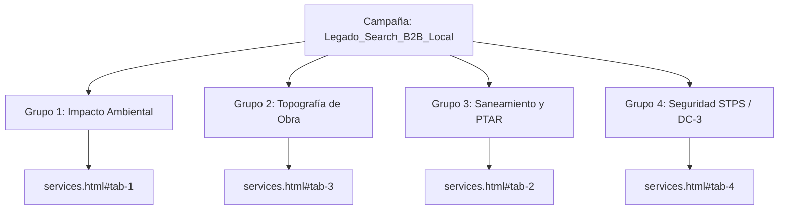

# Guía Estratégica y Manual Técnico de Configuración: Google Business Profile & Google Ads Local
## Legado Ambiental S.A. de C.V.

> **Propósito del Documento:** Complementar el *Plan de Trabajo y Arquitectura UI/UX* con una guía exhaustiva, accionable y técnica para la implementación de los **Pilares 5 (Búsqueda Local y Visibilidad - SEO Local)** y **Pilar 6 (Adquisición de Pago - Google Ads Local)**, detallando su activación comercial y su integración dentro del código del sitio web oficial (`https://www.legadoambiental.com.mx`).

---

## 📑 Tabla de Contenido
1. [Diagnóstico de Situación y Mapeo en el Repositorio](#1-diagnóstico-de-situación-y-mapeo-en-el-repositorio)
2. [Pilar 5: Guía de Configuración de Google Business Profile (SEO Local)](#2-pilar-5-guía-de-configuración-de-google-business-profile-seo-local)
   * 2.1 Creación y Verificación de la Ficha
   * 2.2 Estandarización NAP (Name, Address, Phone)
   * 2.3 Selección Estratégica de Categorías
   * 2.4 Definición de Áreas de Servicio (Service Area Business)
   * 2.5 Catálogo de Servicios y Productos B2B
   * 2.6 Horarios, Atributos y Activos Multimedia
   * 2.7 Protocolo Sistemático de Gestión de Reseñas de Clientes
   * 2.8 Estrategia de Publicaciones Periódicas (Google Updates)
3. [Pilar 6: Guía de Configuración de Google Ads Local (Adquisición Pagada)](#3-pilar-6-guía-de-configuración-de-google-ads-local-adquisición-pagada)
   * 3.1 Vinculación de Cuentas (Google Ads + Google Business Profile)
   * 3.2 Tipo y Arquitectura de Campaña Recomendada
   * 3.3 Segmentación Geográfica y Demográfica Estricta
   * 3.4 Estructura de Grupos de Anuncios por Intención B2B
   * 3.5 Matriz de Palabras Clave (Keywords Positivas)
   * 3.6 Lista Maestra de Palabras Clave Negativas (Negative Keywords)
   * 3.7 Anuncios de Búsqueda Responsivos (RSAs) Optimizados
   * 3.8 Configuración de Recursos / Extensiones de Anuncio
   * 3.9 Medición y Atribución de Conversiones (Leads, Llamadas y WhatsApp)
   * 3.10 Estrategia de Puja y Presupuesto Diario Sugerido
4. [Implementación Técnica en el Sitio Web](#4-implementación-técnica-en-el-sitio-web)
   * 4.1 ¿Dónde se encontraba ya considerado en el proyecto?
   * 4.2 Adecuaciones Técnicas Realizadas en el Código
   * 4.3 Validación de Internacionalización (Regla de Oro i18n)
5. [Checklist Final de Lanzamiento y Monitoreo](#5-checklist-final-de-lanzamiento-y-monitoreo)

---

## 1. Diagnóstico de Situación y Mapeo en el Repositorio

En el **Plan Estratégico de Trabajo y Arquitectura UI/UX** de Legado Ambiental se establecieron dos pilares orientados a la tracción de prospectos:
* **Pilar 5 (Sprint 1 - Tarea PB4):** Enfocado en la presencia orgánica geolocalizada en el Valle de México y la recolección activa de prueba social (reseñas).
* **Pilar 6 (Semana 3 / Post-Proyecto - Tarea PB13):** Enfocado en capturar la demanda activa de empresas con trámites urgentes o licitaciones mediante pauta publicitaria hipersegmentada.

Para que estos dos pilares generen un retorno de inversión medible, la presencia en Google debe alinearse de forma milimétrica con el código, los metadatos y la analítica del sitio web.

---

## 2. Pilar 5: Guía de Configuración de Google Business Profile (SEO Local)

Google Business Profile (GBP) es la piedra angular del SEO local. Permite que Legado Ambiental aparezca en el **Local 3-Pack** de Google Search y en **Google Maps** cuando directores de obra, constructoras o funcionarios buscan servicios de ingeniería y medio ambiente en su zona de influencia.

### 2.1 Creación y Verificación de la Ficha
1. Acceder a [google.com/business](https://www.google.com/business) con la cuenta oficial corporativa (`legado.ambiental.mx@gmail.com`).
2. Introducir el nombre exacto de la empresa: **Legado Ambiental**.
3. Seleccionar tipo de negocio: **Empresa de servicios y oficina comercial**.
4. **Método de verificación en México:**
   * Google suele solicitar **verificación por video** o **código por llamada/SMS** para empresas de servicios profesionales en el Estado de México.
   * *Recomendación para la verificación por video:* Grabar en una sola toma continua:
     1. El letrero/nomenclatura exterior de la calle y número en Valle de Ecatepec.
     2. El acceso al inmueble u oficina.
     3. Instrumentación técnica o papelería corporativa oficial (planos con membrete de Legado Ambiental, equipo topográfico como estación total o niveles, tarjetas de presentación y cédula fiscal SAT).

### 2.2 Estandarización NAP (Name, Address, Phone)
El principio fundamental del SEO local es la **consistencia NAP 1:1**. La información en Google Business Profile debe coincidir exactamente con la que figura en el pie de página y datos estructurados del sitio web:

| Parámetro | Valor Oficial Estandarizado | Coincidencia en Sitio Web |
| :--- | :--- | :--- |
| **Nombre (Name)** | `Legado Ambiental` (Razón Social: `Legado Ambiental S.A. de C.V.`) | Coincide con encabezados y Schema `legalName` |
| **Dirección (Address)** | `U.H. Valle de Ecatepec, C.P. 55119, Ecatepec de Morelos, Estado de México, México` | Coincide en `footer`, `contact_faq.html` y Schema |
| **Teléfono Principal** | `+52 55 8367 1036` (Atención comercial / clientes) | Enlace interactivo `tel:+525583671036` |
| **Teléfono Secundario** | `+52 72 2672 7212` (Ingeniería y soporte técnico) | Enlace interactivo `tel:+527226727212` |
| **Sitio Web** | `https://www.legadoambiental.com.mx` | URL canónica segura HTTPS |
| **Página de Citas/Contacto**| `https://www.legadoambiental.com.mx/faq/contact_faq.html` | Enlace directo al formulario de cotización |

### 2.3 Selección Estratégica de Categorías
Google asigna relevancia algorítmica principalmente a la **categoría primaria**. Es vital seleccionarla con precisión:

* **Categoría Primaria:**
  * `Consultor ambiental` (*Environmental Consultant*): Es la categoría con mayor densidad semántica para trámites ante SEMARNAT, estudios de impacto ambiental y diagnósticos hídricos.
* **Categorías Secundarias (Adicionales):**
  1. `Ingeniero consultor` (*Consulting Engineer*): Abarca proyectos ejecutivos, supervisión de obra e ingeniería hidrosanitaria.
  2. `Empresa constructora` (*Construction Company*): Posiciona para licitaciones, obra civil, vivienda y saneamiento.
  3. `Agrimensor` (*Land Surveyor* / Topografía): Habilita visibilidad ante búsquedas de levantamientos topográficos y fotogrametría.
  4. `Servicio de control de seguridad laboral`: Respalda los servicios de capacitación STPS y trámites DC-3.

### 2.4 Definición de Áreas de Servicio (Service Area Business)
Legado Ambiental atiende clientes en sus oficinas y se desplaza a las ubicaciones de obra. Por ello, en la sección **"Áreas de servicio"** se deben registrar los siguientes municipios y alcaldías prioritarias:

* **Estado de México (Zona Metropolitana y Corredores Industriales):**
  * Ecatepec de Morelos, Tlalnepantla de Baz, Naucalpan de Juárez, Cuautitlán Izcalli, Coacalco de Berriozábal, Tultitlán, Tecámac, Toluca, Lerma, Texcoco, Nezahualcóyotl.
* **Ciudad de México:**
  * Gustavo A. Madero, Azcapotzalco, Cuauhtémoc, Miguel Hidalgo, Álvaro Obregón, Benito Juárez, Venustiano Carranza, Iztapalapa.
* **Cobertura Regional/Nacional:**
  * Agregar **México** como país para proyectos foráneos de gran escala (estudios de impacto ambiental interestatales o supervisión de obra federal).

### 2.5 Catálogo de Servicios y Productos B2B
En el módulo **"Servicios"** de GBP, desglosar la oferta con descripciones técnicas que incluyan palabras clave y enlaces directos:

1. **Estudios de Impacto Ambiental (MIA y Diagnósticos):**
   * *Descripción:* Elaboración integral de Manifestaciones de Impacto Ambiental (MIA), estudios técnicos justificativos, diagnósticos de daño ambiental y cumplimiento normativo NOM-052-SEMARNAT y NOM-001.
   * *Enlace:* `https://www.legadoambiental.com.mx/services_overview/services.html#tab-1`
2. **Topografía de Precisión y Fotogrametría con Dron:**
   * *Descripción:* Levantamientos topográficos, cálculo de volúmenes, deslindes catastrales, curvas de nivel y control geométrico de obra civil con tecnología GPS de alta precisión.
   * *Enlace:* `https://www.legadoambiental.com.mx/services_overview/services.html#tab-3`
3. **Plantas de Tratamiento de Aguas Residuales (PTAR) y Saneamiento:**
   * *Descripción:* Diseño, ingeniería, construcción y supervisión de plantas de tratamiento de agua residual industrial y municipal, obras de drenaje y saneamiento de cauces.
   * *Enlace:* `https://www.legadoambiental.com.mx/services_overview/services.html#tab-2`
4. **Seguridad e Higiene Industrial (STPS y DC-3):**
   * *Descripción:* Capacitación presencial por Agente Capacitador Externo (ACE) certificado ante la STPS, emisión de constancias DC-3 y diseño de sistemas de seguridad en obra.
   * *Enlace:* `https://www.legadoambiental.com.mx/services_overview/services.html#tab-4`

### 2.6 Horarios, Atributos y Activos Multimedia
* **Horario de Operación:**
  * Lunes a Viernes: `08:00 - 18:00`
  * Sábados: `09:00 - 14:00`
  * Domingos: `Cerrado`
* **Fotografías Oficiales a Cargar:**
  1. *Identidad:* Logotipo corporativo en alta resolución (`logo_final_v2.webp`) y foto de portada (`servicios-legado-ambiental-2026-og.png`).
  2. *Equipo de Trabajo y EPP:* Fotografías del personal técnico con equipo de protección personal (cascos, chalecos reflejantes) en sitio de obra.
  3. *Instrumental Técnico:* Tomas del equipo de topografía (estación total, dron de fotogrametría, GPS geodésico).
  4. *Proyectos:* Imágenes de obras representativas (`project-viaduct.webp`, `project-solaris.webp`, `milestone-2024.webp`).
  > **Tip SEO Local:** Renombrar los archivos antes de subirlos a GBP usando nombres semánticos, como: `levantamiento-topografico-estado-de-mexico-legado-ambiental.jpg`, `consultoria-impacto-ambiental-ecatepec.jpg`.

### 2.7 Protocolo Sistemático de Gestión de Reseñas de Clientes
Las reseñas verificadas con 5 estrellas son el factor número 1 de conversión y ranking en el mapa local de Google.

#### Paso A: Obtención del Enlace Corto Oficial de Reseñas
Dentro del panel de GBP, pulsar **"Pedir opiniones"** (*Ask for reviews*) y copiar la URL corta de formato:
`https://g.page/r/[TU_CODIGO_UNICO]/review`

#### Paso B: Plantilla de Mensaje para Solicitar Reseñas (Post-Entrega)
Enviar al director de obra o contraparte técnica 48 horas después de entregar un dictamen, levantamiento o curso:

```text
Estimado/a [Nombre del Cliente]:

En Legado Ambiental ha sido un gusto colaborar con [Nombre de su Empresa] en la realización de [Servicio, ej. el levantamiento topográfico / estudio ambiental para su obra en Ecatepec].

Para nuestro equipo técnico de ingenieros es de gran valor conocer su experiencia. ¿Podría apoyarnos con una breve reseña de 1 minuto en nuestro perfil verificado de Google?

Su comentario ayuda a que otras empresas y despachos constructores conozcan nuestro rigor técnico:
👉 [ENLACE CORTO DE RESEÑAS DE GOOGLE]

Agradecemos de antemano su confianza y quedamos a sus órdenes para futuros proyectos.
Atentamente,
Equipo de Legado Ambiental S.A. de C.V.
```

#### Paso C: Protocolo para Responder a Reseñas (SEO-Optimized)
Responder **al 100% de las reseñas recibidas** en menos de 24 horas, incorporando de manera natural la ubicación y el servicio:

* **Ejemplo de respuesta a reseña positiva:**
  > *"Muchas gracias por su confianza, Ing. [Apellido]. En Legado Ambiental nos comprometemos con la máxima exactitud en cada levantamiento topográfico y trámite normativo en el Estado de México. Quedamos a su disposición para las siguientes fases de su proyecto constructivo."*
* **Ejemplo de respuesta a reseña con observación o incidencia:**
  > *"Agradecemos sus comentarios. En Legado Ambiental priorizamos la calidad técnica y la satisfacción de nuestros clientes corporativos. Nos gustaría revisar a detalle su requerimiento: por favor contáctenos directamente al 55 8367 1036 o a legado.ambiental.mx@gmail.com para brindarle atención inmediata con nuestra dirección de ingeniería."*

### 2.8 Estrategia de Publicaciones Periódicas (Google Updates)
Publicar **1 actualización semanal** en el perfil de Google Business:
* Noticia sobre actualización de normativas (ej. cambios en la NOM-001 de descargas de agua o inspecciones STPS).
* Hito de proyecto entregado con fotografía real y botón de llamada a la acción: *"Más información"* con enlace a `services.html` o *"Llamar ahora"*.

---

## 3. Pilar 6: Guía de Configuración de Google Ads Local (Adquisición Pagada)

El Pilar 6 está concebido como una campaña diferida para la fase post-proyecto, activable a partir de la Semana 3 una vez validado el funcionamiento del embudo orgánico. Su meta es captar búsquedas transaccionales B2B con alta intención de contratación inmediata.

### 3.1 Vinculación de Cuentas (Google Ads + Google Business Profile)
1. Iniciar sesión en [ads.google.com](https://ads.google.com).
2. Dirigirse a **Herramientas y Configuración > Cuentas Vinculadas**.
3. Localizar **Google Business Profile** y vincular la ficha administrada por `legado.ambiental.mx@gmail.com`.
4. Esta vinculación activa automáticamente los **Recursos de Ubicación** (*Location Assets*), permitiendo que los anuncios aparezcan con la dirección de Ecatepec, el mapa y el botón de llamada en Google Maps y en los resultados patrocinados de búsqueda local.

### 3.2 Tipo y Arquitectura de Campaña Recomendada
* **Tipo de Campaña:** **Campaña de Búsqueda (Search Network)** con anuncios de texto responsivos (RSAs).
* **Objetivo de Campaña:** *Clientes potenciales (Leads)*.
* **Redes:** Únicamente Red de Búsqueda de Google (desactivar socios de búsqueda y Red de Display para no desperdiciar presupuesto en clics accidentales).

### 3.3 Segmentación Geográfica y Demográfica Estricta
* **Ubicaciones Geográficas:**
  * Incluir: **Estado de México** y **Ciudad de México**.
  * Opción de presencia: Seleccionar **"Presencia: Personas que se encuentran en tus ubicaciones incluidas"** (NO "Presencia o Interés", para evitar que personas fuera de la zona hagan clics innecesarios).
* **Idiomas:** Español e Inglés (para directivos y despachos de inversión internacional).

### 3.4 Estructura de Grupos de Anuncios por Intención B2B
Estructurar la campaña en 4 grupos temáticos bien definidos, cada uno apuntando a su landing page correspondiente:



### 3.5 Matriz de Palabras Clave (Keywords Positivas)
Utilizar únicamente concordancia de **frase** (`"..."`) y **exacta** (`[...]`). Evitar concordancia amplia pura para proteger el presupuesto.

#### Grupo 1: Estudios de Impacto Ambiental
* `"estudio de impacto ambiental estado de mexico"`
* `"manifestacion de impacto ambiental semarnat cdmx"`
* `"consultoria ambiental para empresas"`
* `"tramites ambientales para constructoras"`
* `[despacho de ingenieria ambiental]`
* `[estudio de impacto ambiental costo]`

#### Grupo 2: Topografía para Obras y Construcción
* `"levantamiento topografico para obra"`
* `"topografia con dron estado de mexico"`
* `"servicios de topografia cdmx"`
* `"deslinde topografico de terrenos"`
* `[brigada de topografia cotizacion]`
* `[curvas de nivel y topografia]`

#### Grupo 3: Saneamiento y Plantas de Tratamiento
* `"construccion de plantas de tratamiento de aguas"`
* `"diseno de ptar industrial"`
* `"obras de saneamiento y drenaje"`
* `[mantenimiento de plantas de aguas residuales]`

#### Grupo 4: Seguridad e Higiene STPS
* `"cursos stps constancia dc3"`
* `"capacitacion en seguridad e higiene para obra"`
* `"asesoria en seguridad y salud en el trabajo"`
* `[agente capacitador externo stps]`

### 3.6 Lista Maestra de Palabras Clave Negativas (Negative Keywords)
Cargar esta lista a nivel de campaña para bloquear tráfico sin intención comercial B2B:

```text
-gratis
-empleo
-vacantes
-bolsa de trabajo
-sueldo
-salario
-que es
-definicion
-wikipedia
-significado
-tarea
-universidad
-carrera
-tesis
-pdf libro
-descargar gratis
-curso gratis
-practicas profesionales
-servicio social
-diplomado gratis
```

### 3.7 Anuncios de Búsqueda Responsivos (RSAs) Optimizados
Ejemplo de configuración de anuncio para el Grupo de **Impacto Ambiental**:

* **Títulos (Hasta 15 títulos de 30 caracteres):**
  1. `Estudios de Impacto Ambiental`
  2. `Consultoría Ambiental B2B`
  3. `Cumplimiento NOM y SEMARNAT`
  4. `Legado Ambiental S.A. de C.V.`
  5. `Dictámenes y Trámites MIA`
  6. `Cotiza tu Estudio Ambiental`
  7. `Ingeniería Ambiental en Edomex`
  8. `Evita Sanciones y Clausuras`
  9. `Asesoría Técnica Inmediata`
* **Descripciones (Hasta 4 descripciones de 90 caracteres):**
  1. `Soluciones integrales en estudios de impacto ambiental y trámites normativos. Cotiza hoy.`
  2. `Más de 20 años respaldando a constructoras e industrias en CDMX y Edomex. Atención técnica.`
  3. `Gestión experta ante SEMARNAT, NOM-052 y normativas estatales. Solicita tu cotización formal.`
  4. `Evita retrasos en tu obra con estudios ambientales aprobados en tiempo y forma. Contáctanos.`
* **URL Final:** `https://www.legadoambiental.com.mx/services_overview/services.html#tab-1`
* **Ruta visible:** `legadoambiental.com.mx/impacto-ambiental/cotizar`

### 3.8 Configuración de Recursos / Extensiones de Anuncio
Activar obligatoriamente los siguientes recursos:
1. **Recurso de Ubicación:** Vinculado a Google Business Profile (muestra la dirección de Ecatepec y cercanía al usuario).
2. **Recurso de Llamada:** Teléfono directo `+52 55 8367 1036` con horario de lunes a viernes de 8:00 a 18:00 hrs.
3. **Recursos de Enlace a Sitio (Sitelinks):**
   * *Cotizar Proyecto:* `https://www.legadoambiental.com.mx/faq/contact_faq.html#tab-1`
   * *Topografía de Precisión:* `https://www.legadoambiental.com.mx/services_overview/services.html#tab-3`
   * *Descargar Portafolio PDF:* `https://www.legadoambiental.com.mx/assets/docs/Portafolio_Proyectos_Legado_Ambiental_2026.pdf`
   * *Quiénes Somos:* `https://www.legadoambiental.com.mx/about_us/about_us.html`
4. **Recursos de Texto Destacado (Callouts):**
   * `+20 Años de Experiencia`
   * `Agente Capacitador STPS`
   * `Cobertura CDMX y Edomex`
   * `Cotización en 24 Horas`
5. **Recursos de Fragmentos Estructurados (Structured Snippets):**
   * Encabezado: *Servicios*
   * Valores: *Impacto Ambiental*, *Topografía*, *PTAR y Saneamiento*, *Seguridad STPS*, *Supervisión de Obra*.

### 3.9 Medición y Atribución de Conversiones (Leads, Llamadas y WhatsApp)
Configurar las siguientes 3 acciones de conversión en Google Ads:

| Acción de Conversión | Categoría en Google Ads | Mecanismo de Disparo en el Sitio | Valor Sugerido |
| :--- | :--- | :--- | :--- |
| **Envío de Formulario** | Cliente potencial (Lead) | Evento `generate_lead` al responder `formsubmit.co` | \$500 MXN |
| **Llamada Telefónica** | Contacto telefónico | Evento `click_phone` al presionar enlaces `tel:+52...` | \$300 MXN |
| **Clic en WhatsApp** | Conversación iniciada | Evento `click_whatsapp` al pulsar enlaces `wa.me` | \$250 MXN |

### 3.10 Estrategia de Puja y Presupuesto Diario Sugerido
* **Fase 1 (Semanas 3 a 5 - Fase de Aprendizaje):**
  * Estrategia de puja: **Maximizar Clics** con un límite de CPC máximo de **\$18.00 - \$25.00 MXN**.
  * Presupuesto diario sugerido: **\$150.00 a \$250.00 MXN/día** (\$4,500 a \$7,500 MXN/mes).
* **Fase 2 (A partir de 30 conversiones acumuladas):**
  * Cambiar a **Maximizar Conversiones** con CPA objetivo (ej. \$120.00 MXN por lead).

---

## 4. Implementación Técnica en el Sitio Web

A continuación se detalla cómo interactúa esta estrategia con el código del sitio web oficial de Legado Ambiental.

### 4.1 ¿Dónde se encontraba ya considerado en el proyecto?
Antes de esta intervención, los aspectos de SEO local y Ads se encontraban referenciados en los siguientes puntos:

1. **Documentación de Proyecto:**
   * En `Plan de Trabajo y Arquitectura UI_UX - Legado Ambiental.md`:
     - Línea 68: Definición del *Pilar 5: Búsqueda Local y Visibilidad (SEO Local)*.
     - Línea 69: Definición del *Pilar 6: Adquisición de Pago (Google Ads Local)*.
     - Línea 99: Tarea `PB4` en Sprint 1 (*Google Business Profile: Perfil verificado, áreas de servicio y fotos*).
     - Líneas 153-155: Especificación de la campaña post-proyecto `PB13`.
   * En `estructura-plan-legadoambiental.md` (Líneas 36-44): Desglose táctico de ambos pilares y proyección de un 20% del tráfico proveniente de SEO local.
   * En `markdown/SEO_RECOMMENDATIONS.md` (Sección 2.2): Propuesta inicial de datos estructurados para Schema.org.
2. **Código Base Previo:**
   * Existía un bloque básico de JSON-LD con `@type: ["ConstructionBusiness", "EnvironmentalConsultancy"]` en todas las páginas.
   * `assets/js/analytics.js` inicializaba `window.dataLayer` y rastreaba clics de WhatsApp y descargas PDF.
   * `faq/contact_faq.html` disparaba el evento `generate_lead` al enviar el formulario.

---

### 4.2 Adecuaciones Técnicas Realizadas en el Código
Para dar soporte nativo a Google Business Profile y Google Ads Local, se implementaron las siguientes adecuaciones técnicas en el repositorio:

#### 1. Actualización de Analítica y Atribución (`assets/js/analytics.js`)
* **Captura automática de `gclid` y UTMs:** Se integró un motor que lee en tiempo de ejecución los parámetros de URL de Google Ads (`gclid`, `wbraid`, `gbraid`, `utm_source`, `utm_campaign`, etc.) y los persiste en `sessionStorage` para asegurar la trazabilidad del lead aunque el usuario navegue entre distintas páginas.
* **Exposición de `window.getMarketingAttribution()`:** Función pública que devuelve el origen de campaña del usuario activo.
* **Auto-instrumentación de Llamadas (`click_phone`):** Se agregó un listener global para detectar clics en cualquier enlace `tel:`, capturando el número telefónico marcado y su ubicación en la página (header, footer o sección de contacto).
* **Auto-instrumentación de Reseñas y Mapas (`click_google_review`, `click_google_maps`):** Rastreo automático de interacciones con la ficha de Google.
* **Función puente de conversiones para Google Ads (`trackGoogleAdsConversion`):** Permite disparar conversiones directas hacia la etiqueta `gtag` de Google Ads tan pronto se configure el ID de conversión (ej. `AW-XXXXX/YYYYY`).

#### 2. Enriquecimiento de Datos Estructurados Schema.org (`LocalBusiness`)
Se reemplazó el marcado JSON-LD básico en las 6 páginas principales (`home.html`, `about_us/about_us.html`, `services_overview/services.html`, `project_portfolio_gallery/portfolio.html`, `experience_timeline/our_experience.html` y `faq/contact_faq.html`) por un Schema de alta fidelidad que incluye:
* `@type: ["LocalBusiness", "ConstructionBusiness", "EnvironmentalConsultancy"]`
* Nombre oficial y razón social: `Legado Ambiental S.A. de C.V.`
* Coordenadas geográficas exactas de Ecatepec: `latitude: 19.6018, longitude: -99.0494`.
* Especificación formal de horarios comerciales (`openingHoursSpecification`).
* Áreas atendidas delimitadas (`areaServed`: Estado de México, Ciudad de México y México).
* Múltiples puntos de contacto (`contactPoint`) con ambos teléfonos (`55 8367 1036` y `72 2672 7212`) e idiomas español/inglés.

#### 3. Tarjeta de Reseñas de Google Business Profile (`faq/contact_faq.html`)
Se incorporó un componente visual destacado en la columna de contacto con:
* Insignia oficial de *Google Business Profile* y 5 estrellas doradas de calificación.
* Texto persuasivo de invitación a dejar una opinión técnica.
* Botón principal: *"Escribir Reseña en Google"* (con atributo `data-action="google-review"`).
* Botón secundario: *"Ver en Google Maps"* (con atributo `data-action="google-maps"`).

#### 4. Enlaces Clicables de Contacto (`tel:`, `mailto:`, `maps`)
* Se convirtieron los números de teléfono de texto estático en enlaces interactivos `tel:+525583671036` y `tel:+527226727212` en `faq/contact_faq.html` y en el pie de página de `home.html`.
* Se enlazó la dirección postal directamente con Google Maps (`https://maps.google.com/?q=Valle+de+Ecatepec+Estado+de+Mexico`).
* Se habilitaron enlaces de acceso rápido a *Google Maps* y *Reseñas en Google* en la barra inferior del footer.

#### 5. Atribución en el Formulario de Cotización (`faq/contact_faq.html`)
El script de envío por AJAX ahora recupera los datos de campaña de Google Ads mediante `getMarketingAttribution()` y los adjunta en el cuerpo de la notificación enviada a `formsubmit.co`:
```javascript
// Atributos inyectados automáticamente al correo de notificación
origen_campana: attribution.utm_campaign || (attribution.gclid ? 'Google Ads Local' : 'Orgánico / Directo'),
google_click_id: attribution.gclid || 'N/A'
```
De esta manera, el equipo de ventas sabrá de inmediato si una cotización provino de un anuncio pagado en Google Ads.

---

### 4.3 Validación de Internacionalización (Regla de Oro i18n)
En cumplimiento estricto de la regla de oro del proyecto, **ningún texto fue colocado de forma estática o quemada**. Todos los nuevos elementos cuentan con su clave correspondiente en `assets/js/i18n.js`:

* **Nuevas llaves en Español (`es-MX`):**
  * `contact_page.google_reviews.badge`: *"Google Business Profile"*
  * `contact_page.google_reviews.title`: *"Calidad Verificada y Reseñas en Google"*
  * `contact_page.google_reviews.desc`: *"¿Has colaborado con Legado Ambiental en un proyecto u obra? Tu testimonio en Google nos ayuda a seguir construyendo valor técnico y confianza con nuevas empresas."*
  * `contact_page.google_reviews.btn_review`: *"Escribir Reseña en Google"*
  * `contact_page.google_reviews.btn_maps`: *"Ver en Google Maps"*
  * `footer.maps_link`: *"Google Maps"*
  * `footer.reviews_link`: *"Reseñas en Google"*
* **Nuevas llaves en Inglés (`en-US`):**
  * `contact_page.google_reviews.badge`: *"Google Business Profile"*
  * `contact_page.google_reviews.title`: *"Verified Quality & Google Reviews"*
  * `contact_page.google_reviews.desc`: *"Have you partnered with Legado Ambiental on a project or site? Your Google review helps us continue building technical credibility and trust with new enterprises."*
  * `contact_page.google_reviews.btn_review`: *"Leave a Google Review"*
  * `contact_page.google_reviews.btn_maps`: *"View on Google Maps"*
  * `footer.maps_link`: *"Google Maps"*
  * `footer.reviews_link`: *"Google Reviews"*

---

## 5. Checklist Final de Lanzamiento y Monitoreo

### Fase Inmediata (Google Business Profile)
- [ ] Completar la verificación por video o código de la ficha en [google.com/business](https://google.com/business).
- [ ] Configurar las categorías primaria (*Consultor ambiental*) y secundarias (*Ingeniero consultor*, *Empresa constructora*, *Agrimensor*).
- [ ] Añadir las áreas de servicio de CDMX y municipios del Estado de México.
- [ ] Cargar las fotografías del equipo con EPP, instrumental topográfico y proyectos.
- [ ] Obtener el enlace corto de reseñas de Google y reemplazar temporalmente la búsqueda genérica en el botón *"Escribir Reseña en Google"* si se desea apuntar al identificador exacto de la ficha.
- [ ] Solicitar las primeras 5 reseñas a clientes históricos de confianza.

### Fase Post-Proyecto (Google Ads Local - Semana 3)
- [ ] Crear la cuenta en Google Ads y vincularla con la ficha de Google Business Profile verificada.
- [ ] Insertar la etiqueta de Google Tag (`gtag.js` con el ID `AW-XXXXXXXXX`) en el encabezado `<head>` de las páginas HTML o vía Google Tag Manager.
- [ ] Configurar las 3 conversiones principales: `generate_lead`, `click_phone` y `click_whatsapp`.
- [ ] Dar de alta la campaña de búsqueda con segmentación geográfica exclusiva en CDMX y Edomex.
- [ ] Cargar la lista maestra de palabras clave negativas para proteger el presupuesto.
- [ ] Publicar los anuncios responsivos con recursos de llamada, ubicación y enlaces de sitio.
- [ ] Monitorear semanalmente la tasa de conversión y el costo por lead cualificado (CPA).
