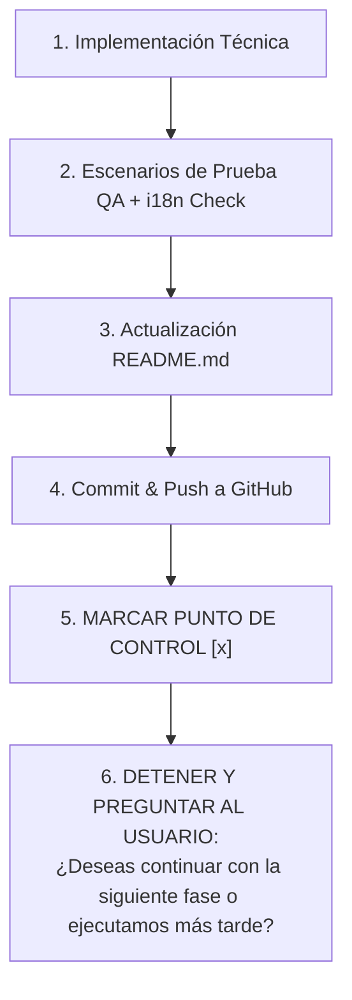

# Plan Técnico de Trabajo UI/UX y CRO: Captura de los Primeros 100 Leads B2B
## Optimización del Sitio Web Empresarial - Legado Ambiental

Este documento establece la hoja de ruta técnica detallada para la reestructuración UI/UX y optimización de tasa de conversión (CRO) de la plataforma digital **Legado Ambiental**. El objetivo central es evolucionar el sitio web desde un catálogo informativo estático hacia un embudo de conversión B2B activo y de alto rendimiento, diseñado para capturar a los **primeros 100 leads cualificados** (empresas constructoras, despachos de ingeniería civil, plantas industriales y dependencias públicas con proyectos o trámites ambientales).

El plan se ejecuta en **5 Fases secuenciales**. Cada fase sigue un protocolo estricto de ingeniería de software que incluye: **implementación técnica, escenarios de prueba local (QA), validación estricta de i18n (`assets/js/i18n.js`), actualización del archivo `README.md`, versionado Git (commit/push)** y un **Punto de Control (Checkpoint) obligatorio con consulta de confirmación al usuario**.

---

## 🎨 Architecture & Design Tokens Base

* **Motor CSS:** Tailwind CSS v3 (vía CDN) con plugins de formularios y container queries.
* **Tipografías Corporativas:**
  * `Manrope` (Sans-serif geométrica): Cuerpo técnico, UI, botones y formularios.
  * `Merriweather` (Serif de autoridad): Encabezados principales (`h1`, `h2`, `h3`).
* **Tokens de Color Corporativos (Design Tokens):**
  * `Primary` (Verde Esmeralda `#22c55e`): CTAs principales, bordes activos y sustentabilidad.
  * `Secondary` (Azul Rey `#3b82f6`): Acentos de ingeniería, topografía y saneamiento.
  * `Navy` (Azul Pizarra Oscuro `#0f172a`): Encabezados, cabeceras y footers.
  * `Charcoal` (Gris Carbón `#334155`): Cuerpo de texto sobre fondos claros.
* **Stack Técnico Complementario:** JavaScript Vanilla, FormSubmit API, Honeypot Anti-Bot, Notificaciones Toast UI, AOS (Animate on Scroll), i18n Custom System (`assets/js/i18n.js`).

---

## 🌐 REGLA DE ORO: Garantía de Internacionalización (`assets/js/i18n.js`)

> **[REGLA DE ORO I18N]**: Bajo ninguna circunstancia se deben agregar textos, títulos, marcadores de posición (placeholders), botones, notificaciones Toast o etiquetas directamente "quemadas" (hardcoded) en los archivos HTML. 
> 
> Todo nuevo elemento textual DEBE:
> 1. Poseer su atributo `data-i18n="categoria.clave"`.
> 2. Estar registrado tanto en el diccionario Español (`es-MX`) como en Inglés (`en-US`) dentro de `assets/js/i18n.js`.
> 3. Ser auditado al finalizar la fase mediante el switch bilingüe (ES ↔ EN) para comprobar que no existan errores en consola, llaves sin traducir (`undefined` o `auto_generated.text_xyz`) ni roturas de layout.

---

## 🛑 PROTOCOLO DE PUNTOS DE CONTROL (CHECKPOINTS)

Para asegurar el control absoluto sobre cada ajuste y evitar ejecuciones descontroladas, **Antigravity IDE deberá aplicar estrictamente la siguiente secuencia en cada Fase**:



---

## 🚀 FASE 1: Infraestructura Mobile-First, Design Tokens y Header Flotante Responsivo

### 1.1 Objetivo y Alcance
Eliminar los problemas de desbordamiento horizontal (`overflow-x`) en dispositivos móviles pequeños (320px - 375px), estandarizar los Design Tokens de color en la configuración global y asegurar que todos los elementos interactivos cumplan con zonas táctiles (Touch Targets) de mínimo 48x48px (WCAG 2.1 AAA).

### 1.2 Implementación Técnica Detallada
1. **Header Elástico y Responsivo (`<header>` en todas las páginas HTML):**
   * Ajustar la regla `w-[calc(100%-2rem)] max-w-[1200px]` en móviles para evitar que el logo (`h-16`) y el texto corporativo colisionen con el menú hamburguesa.
   * Reducir el escalado del logo en pantallas móviles a `h-10 sm:h-16` y aplicar truncado sutil en el texto si la pantalla es de 320px.
2. **Menú Hamburguesa & Desplegable Móvil (`#mobile-menu`):**
   * Configurar `#mobile-menu` con `position: fixed`, `top-20`, `left-4`, `right-4`, `max-h-[85vh]` y `overflow-y-auto` con scroll independiente.
   * Incrementar las zonas táctiles de los botones de idioma (`ES | EN`), toggle de modo oscuro (`dark_mode`) y enlaces del menú a un mínimo de **48x48px**.
3. **Estandarización de Design Tokens (`assets/js/theme-config.js`):**
   * Validar que los colores corporativos (`#22c55e`, `#0f172a`, `#334155`, `#3b82f6`) estén centralizados y apliquen ratios de contraste superior a 4.5:1 sobre fondos claros y oscuros.
4. **Sincronización i18n (`assets/js/i18n.js`):**
   * Verificar claves de traducción del header responsivo en `es-MX` y `en-US`.

### 1.3 Escenarios de Prueba y QA (Cero Regresión + i18n)
* 🧪 **Escenario 1.1 (Prueba Viewport Móvil 320px - 375px):** Verificar que el scrollbar horizontal sea `0px` y no exista desbordamiento lateral.
* 🧪 **Escenario 1.2 (Prueba Interacción Menú Hamburguesa):** Despliegue y cierre suave del menú móvil sin tapar el viewport.
* 🧪 **Escenario 1.3 (Prueba de Internacionalización i18n Header):** Alternar entre `ES` y `EN` desde el header responsivo; confirmar traducción instantánea de todas las opciones del menú sin fallos en `i18n.js`.
* 🧪 **Escenario 1.4 (Prueba Toggle Modo Oscuro/Claro):** Cambiar de tema en desktop y móvil; verificar persistencia en `localStorage` y ausencia de destellos de color (FOUC).

### 1.4 Documentación en `README.md`
* Registrar en la sección de "Registro de Cambios" del `README.md` los ajustes realizados a la cabecera responsiva, touch targets de 48px y validación i18n.

### 1.5 Versionado Git & Push
```bash
git add .
git commit -m "feat(uiux): [Fase 1] Header responsivo mobile-first, design tokens y touch targets de 48px"
git push origin <rama_actual>
```

### 🛑 PUNTO DE CONTROL - FASE 1
- [x] **Punto de Control 1:** Fase 1 Concluida, Validada y Lista en Repositorio.
> **INSTRUCCIÓN PARA ANTIGRAVITY IDE:** Al concluir el paso 1.5, marca la casilla anterior `[x]`, **DETÉN LA EJECUCIÓN** y consulta al usuario:
> *"La Fase 1 se ha ejecutado, probado en i18n, documentado en README.md y subido al repositorio GitHub. ¿Deseas continuar inmediatamente con la Fase 2 o lo ejecutamos más tarde?"*

---

## 🎯 FASE 2: Rediseño del Hero Section JTBD, Tipografía Fluida y Grids Adaptativos

### 2.1 Objetivo y Alcance
Transformar la sección principal (Hero) de la página de inicio desde un enfoque estático hacia una propuesta de valor centrada en la resolución de problemas (Jobs-To-Be-Done), incorporando llamados a la acción (CTAs) directos y una barra de normativas oficiales (Hero Trust Banner) para generar confianza inmediata en el visitante B2B.

### 2.2 Implementación Técnica Detallada
1. **Rediseño del Hero Section (`home.html`):**
   * Reemplazar titular por copys orientados a resolución de necesidades: *"¿Necesitas resolver un estudio de impacto ambiental, proyecto de obra o levantamiento topográfico?"*.
   * Eliminar la altura fija `min-h-[450px]` en móvil; aplicar `min-h-[auto] py-12 md:py-20` con padding adaptativo (`p-5 sm:p-8 md:p-16`).
2. **Integración de CTAs Principales:**
   * Botón Primario: *"Cotizar Proyecto"* (Redirige a formulario con autoscroll o apertura de modal).
   * Botón Secundario: *"Hablar por WhatsApp"* (Enlace directo a API de WhatsApp con mensaje predeterminado).
   * Botón Terciario: *"Ver Portafolio PDF"* (Enlace de descarga de `Portafolio_Proyectos_Legado_Ambiental_2026.pdf`).
3. **Hero Trust Banner (Barra de Confianza Normativa):**
   * Insertar una franja estilizada debajo del Hero con insignias de normativas clave: `NOM-052-SEMARNAT`, `Normativas STPS`, `NOM-001`, `Trámites Municipales/Estatales`.
4. **Grid de Estadísticas Responsivo:**
   * Asegurar apilamiento vertical perfecto en 1 columna (`grid-cols-1 md:grid-cols-2`) en pantallas `< 768px` con tarjetas de acabado Glassmorphism (`backdrop-blur-md`).
5. **Sincronización i18n (`assets/js/i18n.js`):**
   * Registrar las llaves de traducción para los nuevos titulares JTBD, etiquetas de botones y normativas del Trust Banner en `es-MX` y `en-US`.

### 2.3 Escenarios de Prueba y QA (Cero Regresión + i18n)
* 🧪 **Escenario 2.1 (Prueba Adaptabilidad del Hero):** Probar el Hero en 360px, 768px y 1440px; verificar ajuste fluido de texto e imagen de fondo WebP.
* 🧪 **Escenario 2.2 (Prueba Descarga de Portafolio PDF):** Confirmar que "Ver Portafolio PDF" abra/descargue el archivo sin error 404.
* 🧪 **Escenario 2.3 (Prueba Enlace WhatsApp):** Validar redirección limpia a WhatsApp con mensaje inicial prellenado.
* 🧪 **Escenario 2.4 (Prueba de Internacionalización i18n en Hero):** Cambiar entre `ES` y `EN`; verificar que el 100% de los elementos del Hero y Trust Banner se traduzcan sin dejar llaves crudas o textos en español quemados.

### 2.4 Documentación en `README.md`
* Registrar en `README.md` la implementación de la propuesta JTBD en el Hero, la adición del Trust Banner de normativas y la reestructuración responsiva del grid de estadísticas.

### 2.5 Versionado Git & Push
```bash
git add .
git commit -m "feat(uiux): [Fase 2] Hero section JTBD, trust banner de normativas y tipografia fluida responsiva"
git push origin <rama_actual>
```

### 🛑 PUNTO DE CONTROL - FASE 2
- [x] **Punto de Control 2:** Fase 2 Concluida, Validada y Subida a GitHub.
> **INSTRUCCIÓN PARA ANTIGRAVITY IDE:** Al concluir el paso 2.5, marca la casilla anterior `[x]`, **DETÉN LA EJECUCIÓN** y consulta al usuario:
> *"La Fase 2 se ha ejecutado, probado en i18n, documentado en README.md y subido al repositorio GitHub. ¿Deseas continuar inmediatamente con la Fase 3 o lo ejecutamos más tarde?"*

---

## 📑 FASE 3: Pestañas de Servicios Adaptativas y Aislamiento de Layout PDF

### 3.1 Objetivo y Alcance
Resolver la pérdida de visibilidad en móvil de la sección de servicios en `services.html` transformando la barra de pestañas ciega (`no-scrollbar`) en una interfaz táctil adaptativa. Asimismo, aislar la arquitectura de páginas en pulgadas (`8.5in x 11in`) exclusivamente a reglas de impresión `@media print` para no comprometer la fluidez web en pantalla.

### 3.2 Implementación Técnica Detallada
1. **Navegación por Pestañas Adaptativa (`services_overview/services.html`):**
   * En pantallas móviles (`< 640px`), transformar la fila de botones en un **Desplegable Acordeón Táctil** o **Select UI de Alta Visibilidad**, permitiendo al usuario explorar las 4 grandes divisiones: *Ingeniería Ambiental*, *Construcción*, *Topografía*, *Seguridad e Higiene*.
   * En pantallas desktop (`>= 640px`), mantener las pestañas horizontales con efecto visual de pestaña activa (Verde `Primary`).
2. **Aislamiento de la Arquitectura PDF vs Web:**
   * Encapsular la estructura `.page-container` en pulgadas (`8.5in x 11in`) dentro de `@media print`, asegurando que en `@media screen` las páginas web ocupen el 100% del ancho fluido sin márgenes rígidos.
   * Aplicar la regla CSS `@media print { .no-print { display: none !important; } }` para ocultar botones flotantes, menús y formularios al exportar a PDF.
3. **Estandarización de Tarjetas y Badges UI:**
   * Tarjetas de servicio con bordes laterales de categoría (`border-l-2`) y Badges Soft UI (`bg-primary/10 text-primary font-bold text-[10px]`).
4. **Sincronización i18n (`assets/js/i18n.js`):**
   * Auditar que las 4 categorías de servicios y descripciones extendidas tengan asignado su correspondiente `data-i18n` sin duplicados.

### 3.3 Escenarios de Prueba y QA (Cero Regresión + i18n)
* 🧪 **Escenario 3.1 (Prueba Navegación por Pestañas):** Probar el cambio entre las 4 categorías en móvil (< 640px) y desktop (1200px); verificar transiciones de opacidad.
* 🧪 **Escenario 3.2 (Prueba Deep Linking por Hash):** Acceder a `services.html#tab-3` y comprobar que la pestaña de *Topografía* se active automáticamente.
* 🧪 **Escenario 3.3 (Prueba Impresión PDF `@media print`):** Abrir vista previa de impresión (Ctrl+P / Cmd+P) en `Curricula_Legado_Ambiental_2026.html` y verificar alineación limpia sin saltos de página partidos ni botones interactivos visibles.
* 🧪 **Escenario 3.4 (Prueba Internacionalización i18n en Servicios):** Probar la conmutación `ES` ↔ `EN` en todas las pestañas de servicios; asegurar cero errores en la carga de textos desde `i18n.js`.

### 3.4 Documentación en `README.md`
* Actualizar `README.md` documentando la conversión adaptativa del módulo de pestañas de servicios para móviles y la separación estricta entre estilos de pantalla web e impresión PDF.

### 3.5 Versionado Git & Push
```bash
git add .
git commit -m "feat(uiux): [Fase 3] Pestañas de servicios adaptativas en movil y aislamiento de layout PDF"
git push origin <rama_actual>
```

### 🛑 PUNTO DE CONTROL - FASE 3
- [x] **Punto de Control 3:** Fase 3 Concluida, Validada y Subida a GitHub.
> **INSTRUCCIÓN PARA ANTIGRAVITY IDE:** Al concluir el paso 3.5, marca la casilla anterior `[x]`, **DETÉN LA EJECUCIÓN** y consulta al usuario:
> *"La Fase 3 se ha ejecutado, probado en i18n, documentado en README.md y subido al repositorio GitHub. ¿Deseas continuar inmediatamente con la Fase 4 o lo ejecutamos más tarde?"*

---

## 📱 FASE 4: Formulario Móvil Ultra-Simplificado (6 Campos) & Sticky Mobile CTA Bar

### 4.1 Objetivo y Alcance
Maximizar la tasa de conversión (CRO) reduciendo el formulario de contacto a un esquema de 6 campos de ultra-baja fricción e implementar una barra de llamados a la acción persistente en la parte inferior de dispositivos móviles (Sticky Mobile CTA Bar).

### 4.2 Implementación Técnica Detallada
1. **Sticky Mobile CTA Bar (Barra de Contacto Inferior Fija):**
   * Crear barra flotante fija en el viewport inferior (`fixed bottom-0 left-0 right-0 z-40 md:hidden bg-white/95 dark:bg-[#121c27]/95 backdrop-blur-lg border-t border-gray-200 dark:border-white/10 p-3 flex gap-3 shadow-[0_-4px_20px_rgba(0,0,0,0.15)]`).
   * Botón 1: *"WhatsApp Directo"* (Verde Esmeralda con icono oficial).
   * Botón 2: *"Cotizar Proyecto"* (Dispara modal o autoscroll al formulario).
2. **Simplificación del Formulario de Contacto (6 Campos en `contact_faq.html`):**
   * Campo 1: Nombre Completo (`type="text"`, `required`).
   * Campo 2: Empresa / Dependencia (`type="text"`, `required`).
   * Campo 3: Teléfono / WhatsApp (`type="tel"`, `inputmode="numeric"`, `required`).
   * Campo 4: Servicio Requerido (Selector `<select>` con opciones: *Consultoría Ambientales*, *Topografía*, *Saneamiento*, *Seguridad STPS*, *Otros*).
   * Campo 5: Ubicación del Proyecto (`type="text"`).
   * Campo 6: Breve Descripción (`<textarea>`, 3 filas).
3. **Hardening Anti-Bot y Feedback Visual:**
   * Reemplazar desafíos numéricos molestos por la técnica **Honeypot** (campo invisible para engañar bots spam).
   * Notificaciones emergentes **Toast UI** en Tailwind CSS para retroalimentación de envío exitoso o error.
   * Loader interactivo con deshabilitación de botón al presionar "Enviar" para prevenir múltiples envíos.
4. **Sincronización i18n (`assets/js/i18n.js`):**
   * Registrar llaves de traducción para las notificaciones Toast, opciones del selector de servicios, placeholders del formulario y botones de la Sticky CTA Bar en `es-MX` y `en-US`.

### 4.3 Escenarios de Prueba y QA (Cero Regresión + i18n)
* 🧪 **Escenario 4.1 (Prueba Envío Formulario Exitoso):** Llenar los 6 campos, enviar formulario y comprobar loader, notificación Toast y recepción en `formsubmit.co`.
* 🧪 **Escenario 4.2 (Prueba Anti-Bot Honeypot):** Simular relleno del campo oculto Honeypot y confirmar bloqueo del envío.
* 🧪 **Escenario 4.3 (Prueba Visibilidad Sticky Mobile CTA Bar):** Redimensionar a `< 768px` y verificar que la barra inferior se mantenga fija sin tapar información.
* 🧪 **Escenario 4.4 (Prueba Teclado Virtual Móvil):** Enfocar inputs en smartphone y verificar que el teclado virtual no tape el botón de envío ni descompagine el header.
* 🧪 **Escenario 4.5 (Prueba Internacionalización i18n Formulario & Toast):** Cambiar a `EN` y enviar formulario; comprobar que el mensaje de confirmación Toast y los placeholders aparezcan 100% en inglés.

### 4.4 Documentación en `README.md`
* Registrar en `README.md` el rediseño del formulario simplificado de 6 campos, la integración de Honeypot anti-spam, la barra fija Sticky CTA y la actualización de llaves i18n.

### 4.5 Versionado Git & Push
```bash
git add .
git commit -m "feat(uiux): [Fase 4] Sticky mobile CTA bar y formulario de contacto simplificado de 6 campos"
git push origin <rama_actual>
```

### 🛑 PUNTO DE CONTROL - FASE 4
- [x] **Punto de Control 4:** Fase 4 Concluida, Validada y Subida a GitHub.
> **INSTRUCCIÓN PARA ANTIGRAVITY IDE:** Al concluir el paso 4.5, marca la casilla anterior `[x]`, **DETÉN LA EJECUCIÓN** y consulta al usuario:
> *"La Fase 4 se ha ejecutado, probado en i18n, documentado en README.md y subido al repositorio GitHub. ¿Deseas continuar inmediatamente con la Fase 5 o lo ejecutamos más tarde?"*

---

## 📊 FASE 5: Analítica GA4/GTM, SEO Local & Validación Final de Cero Regresión

### 5.1 Objetivo y Alcance
Instrumentar la medición automatizada de conversiones para evaluar la meta de los 100 leads, optimizar los metadatos de SEO Local para motores de búsqueda y ejecutar una auditoría integral de cero regresión cross-browser y multidispositivo.

### 5.2 Implementación Técnica Detallada
1. **Configuración de Eventos de Conversión (GA4 / Google Tag Manager):**
   * Evento `click_whatsapp`: Activado al pulsar cualquier botón de WhatsApp (Header, Hero, Sticky CTA, Footer).
   * Evento `generate_lead`: Activado tras un envío exitoso del formulario de 6 campos.
   * Evento `download_portfolio`: Activado al descargar el portafolio PDF o currículum empresarial.
2. **SEO Local y Datos Estructurados (Schema.org):**
   * Verificar la inyección de Schema.org tipo `ConstructionBusiness` y `EnvironmentalConsultancy` en la etiqueta `<head>` de todas las páginas principales.
   * Confirmar la consistencia del dominio `https://www.legadoambiental.com.mx` en etiquetas canonical, OpenGraph y Twitter Cards.
3. **Auditoría de Rendimiento y Accesibilidad:**
   * Optimizar la carga diferida (`loading="lazy"`) en todas las imágenes WebP.
   * Verificar atributos `aria-label` en botones interactivos con solo iconos.
4. **Auditoría Final i18n (`assets/js/i18n.js`):**
   * Inspección exhaustiva de todo el diccionario JS para asegurar paridad 1:1 entre las llaves de `es-MX` y `en-US`.

### 5.3 Escenarios de Prueba y QA (Cero Regresión Global + i18n)
* 🧪 **Escenario 5.1 (Auditoría Clics y Conversiones en Consola):** Disparar los eventos interactivos (WhatsApp, Formulario, PDF) con la consola abierta y verificar emisión de `dataLayer.push`.
* 🧪 **Escenario 5.2 (Prueba Cross-Browser & Multidispositivo):** Recorrido completo en Chrome, Safari, Firefox y Edge en 360px, 768px, 1024px y 1440px.
* 🧪 **Escenario 5.3 (Prueba Integral Final i18n):** Recorrer las 6 páginas del sitio en inglés y español; asegurar cero etiquetas sin traducir, cero textos quemados y cero excepciones en `i18n.js`.
* 🧪 **Escenario 5.4 (Validación Enrutamiento .htaccess):** Probar que el acceso a la raíz o a `index.html` redirija limpiamente (301) hacia `home.html`.

### 5.4 Documentación en `README.md`
* Documentar en `README.md` la conclusión del plan de optimización UI/UX y CRO para 100 leads, el mapa de eventos de analítica configurados y la verificación final de rendimiento.

### 5.5 Versionado Git & Push
```bash
git add .
git commit -m "feat(uiux): [Fase 5] Integracion de analitica GA4, SEO local y pruebas de cero regresion final"
git push origin <rama_actual>
```

### 🛑 PUNTO DE CONTROL - FASE 5 (CIERRE DEL PROYECTO)
- [x] **Punto de Control 5:** Fase 5 Concluida, Proyecto 100% Validado y Subido a GitHub.
> **INSTRUCCIÓN PARA ANTIGRAVITY IDE:** Al concluir el paso 5.5, marca la casilla anterior `[x]`, **DETÉN LA EJECUCIÓN** y notifica al usuario:
> *"El Plan de Mejoras UI/UX y CRO para la captación de 100 Leads ha sido completado exitosamente en sus 5 Fases. Todas las pruebas de i18n, responsividad y cero regresión fueron superadas y los cambios están integrados en el repositorio remotos de GitHub."*

---

## 📈 Resumen de Entregables y Matriz de Control de Calidad

| Fase | Entregable Principal | Validación i18n (`i18n.js`) | Criterio QA & Git | Punto de Control |
| :--- | :--- | :--- | :--- | :--- |
| **Fase 1** | Header Flotante Responsivo & Design Tokens | Menú y toggles bilingües | Cero overflow en 320px; Commit/Push | `[x] Punto de Control 1` |
| **Fase 2** | Hero Section JTBD & Trust Banner Normativo | Copys JTBD y normativas bilingües | Tipografía fluida; CTR botones; Commit/Push | `[x] Punto de Control 2` |
| **Fase 3** | Tabs de Servicios Adaptativas & Layout PDF | Categorías y descripciones i18n | 100% visibilidad móvil; `@media print`; Commit/Push | `[x] Punto de Control 3` |
| **Fase 4** | Formulario 6 Campos & Sticky Mobile CTA | Toasts y Sticky CTA bilingües | Envío sin fricción; Honeypot; Commit/Push | `[x] Punto de Control 4` |
| **Fase 5** | Analítica GA4, SEO Local & QA Global | Paridad 1:1 `es-MX`/`en-US` | Trackeo de leads activo; Commit/Push | `[x] Punto de Control 5` |

---
*Este plan está optimizado para su interpretación e implementación automatizada o guiada mediante Antigravity IDE.* 🛠️
