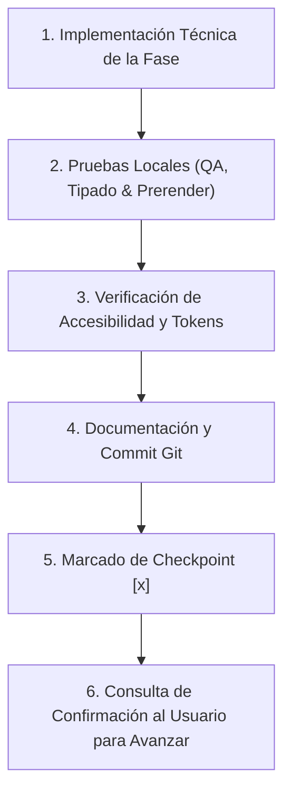
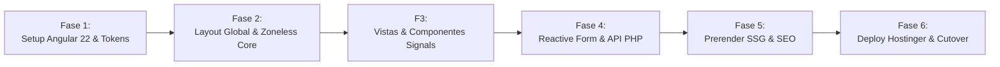

# Plan de Trabajo: Transición de HTML Estático a Arquitectura Base en Angular 22 (Prerender SSG)
## Plataforma Digital Empresarial: Legado Ambiental
**Stack Tecnológico Seleccionado:** Angular 22 (v22.2.1 Estable - Standalone, Zoneless Signals, Reactive Forms, Prerender SSG)  
**Backend:** API desacoplada de leads en PHP 8 / MySQL (Hostinger compatible)  
**Infraestructura de Despliegue:** Hostinger (Modo Estándar Compilado / LiteSpeed Web Server)  
**Versión del Plan:** 2.0 (Actualizado a Angular 22)  
**Fecha:** Octubre 2026  

---

## 1. Resumen Ejecutivo y Decisiones de Arquitectura

El presente plan establece la ruta técnica y operativa para transformar el sitio web de **Legado Ambiental** desde un conjunto de páginas HTML estáticas ([`home.html`](file:///home/andrew/Development/workspace-legado-ambiental/website-legado/home.html), [`faq/contact_faq.html`](file:///home/andrew/Development/workspace-legado-ambiental/website-legado/faq/contact_faq.html), etc.) hacia una arquitectura moderna, ultra-rápida y modular basada en **Angular 22 (v22.2.1, la versión más reciente estable conocida)** con **Prerendering SSG (Static Site Generation)**.

### Innovaciones Clave de Angular 22 Adoptadas en este Proyecto
1. **Arquitectura Zoneless Nativa (`provideZonelessChangeDetection`):** Se prescinde de `zone.js`, reduciendo el peso del bundle JavaScript en más de **35 KB gzip** y permitiendo que la detección de cambios sea 100% reactiva mediante **Signals**, optimizando las métricas de Interaction to Next Paint (INP) y First Input Delay.
2. **Signal Inputs & Outputs Modernos:** Reemplazo de los decoradores `@Input()` y `@Output()` por funciones reactivas nativas `input.required<T>()`, `computed()` y `output<T>()`.
3. **Control Flow Integrado:** Sintaxis declarativa `@for (item of items; track item.id)`, `@if` y `@switch` integrada en el compilador, eliminando el overhead de directivas estructurales antiguas (`*ngFor`, `*ngIf`).
4. **Vistas Diferidas (@defer):** Carga diferida inteligente (`@defer (on viewport)`) para elementos pesados como carruseles de fotos, líneas de tiempo y galerías del portafolio.
5. **Estrategia de Renderizado (Prerender SSG):** Compilación estática en tiempo de construcción (`ng build --prerender`) mediante el nuevo **Application Builder** (`@angular/build:application` con esbuild + Vite). Genera HTML estático pre-renderizado para todas las rutas clave, garantizando indexación instantánea en buscadores y compatibilidad universal con cualquier plan de Hostinger sin requerir servidor Node.js en producción.
6. **Estilos y Design Tokens:** **Tailwind CSS v3** compilado en el pipeline de build, preservando los tokens de color corporativos:
   * **Primary (Verde Esmeralda):** `#22c55e`
   * **Secondary (Azul Rey):** `#3b82f6`
   * **Navy (Azul Pizarra Oscuro):** `#0f172a`
   * **Charcoal (Gris Carbón):** `#334155`
   * **Tipografías:** `Manrope` (cuerpo técnico/UI) y `Merriweather` (autoridad/encabezados).
7. **Backend Desacoplado para Leads:** Micro-API REST en **PHP 8** (`api/contact.php`) con conexión PDO a MySQL y notificaciones SMTP autenticadas, nativa para Hostinger.
8. **Servidor y Caché:** Alojamiento en Hostinger bajo servidor **LiteSpeed** mediante configuración optimizada en [`.htaccess`](file:///home/andrew/Development/workspace-legado-ambiental/website-legado/.htaccess) (compresión Brotli/Gzip, caché agresiva y redirecciones 301).

---

## 2. Protocolo de Ejecución y Puntos de Control (Checkpoints)

Para asegurar un proceso predecible, ordenado y sin regresiones visuales ni de conversión, cada fase seguirá este flujo:



---

## 3. Estructura de Directorios de la Nueva Arquitectura

El proyecto Angular se organizará bajo una estructura desacoplada y escalable dentro del repositorio:

```
website-legado/
├── .htaccess                           # Reglas LiteSpeed y redirecciones 301
├── api/                                # Backend desacoplado en PHP 8
│   ├── config.php                      # Conexión MySQL y credenciales SMTP
│   └── contact.php                     # Endpoint POST para captura y validación de leads
├── angular-app/                        # Aplicación base Angular 22
│   ├── angular.json                    # Configuración de build con Application Builder y prerender
│   ├── tailwind.config.js              # Design tokens corporativos
│   ├── tsconfig.json                   # Tipado estricto de TypeScript
│   └── src/
│       ├── app/
│       │   ├── app.config.ts           # Configuración Zoneless, Router y ClientHydration
│       │   ├── core/                   # Servicios globales singleton (Theme, I18n, Analytics)
│       │   │   ├── services/
│       │   │   └── models/
│       │   ├── shared/                 # Componentes reutilizables y directivas
│       │   │   ├── components/
│       │   │   │   ├── header/         # Sticky navigation, mobile-first con Signals
│       │   │   │   ├── footer/         # Pie de página institucional
│       │   │   │   ├── service-card/   # Migración moderna de ServiceCard_Component.jsx
│       │   │   │   └── toast/          # Sistema accesible de notificaciones
│       │   │   └── directives/
│       │   └── features/               # Vistas principales de la plataforma
│       │       ├── home/               # Hero JTBD, trust banner, servicios resumen
│       │       ├── about/              # Quiénes somos, trayectoria, equipo
│       │       ├── services/           # Catálogo detallado por especialidad
│       │       ├── portfolio/          # Galería con filtros dinámicos por Signal
│       │       ├── experience/         # Línea de tiempo de proyectos
│       │       └── contact/            # Formulario reactivo y preguntas frecuentes
│       ├── assets/                     # Imágenes WebP optimizadas y documentos PDF
│       └── environments/               # Variables de entorno (producción vs desarrollo)
```

---

## 4. Desglose Detallado de Fases de Ejecución



---

### 🚀 FASE 1: Inicialización del Proyecto Angular 22, Tailwind y Entorno Base

#### 1.1 Objetivo y Alcance
Crear el espacio de trabajo en Angular 22 (v22.2.1) con componentes Standalone, arquitectura Zoneless basada en Signals y Application Builder (esbuild), configurando la integración de Tailwind CSS v3 con los design tokens corporativos exactos de Legado Ambiental.

#### 1.2 Implementación Técnica Detallada
1. **Generación del Workspace Angular 22:**
   * Inicializar proyecto en `angular-app/` con Angular CLI v22.2.1:
     ```bash
     npx -p @angular/cli@22 ng new angular-app --standalone --routing --style=css --ssr=false
     ```
   * En `app.config.ts`, configurar el soporte Zoneless y optimizaciones de hidratación:
     ```typescript
     export const appConfig: ApplicationConfig = {
       providers: [
         provideExperimentalZonelessChangeDetection(),
         provideRouter(routes, withComponentInputBinding()),
         provideHttpClient(withFetch())
       ]
     };
     ```
   * Habilitar prerendering en `angular.json` para compilación estática instantánea.
2. **Configuración de Tailwind CSS y PostCSS:**
   * Instalar y configurar `tailwindcss`, `postcss`, `autoprefixer` y `@tailwindcss/forms`.
   * Integrar la paleta corporativa y tipografías en `tailwind.config.js`:
     ```javascript
     colors: {
       primary: '#22c55e',
       primaryDark: '#16a34a',
       secondary: '#3b82f6',
       navy: '#0f172a',
       charcoal: '#334155',
       'background-light': '#f8fafc',
       'background-dark': '#0b1120'
     },
     fontFamily: {
       sans: ['Manrope', 'sans-serif'],
       serif: ['Merriweather', 'serif']
     }
     ```
3. **Migración de Activos:**
   * Enlazar los activos multimedia optimizados en WebP desde `assets/images/` y los documentos PDF de `assets/docs/` a la estructura de Angular.
4. **Configuración de Fuentes Web:**
   * Importar `Manrope` y `Merriweather` con `font-display: swap` y los iconos de `Material Symbols Outlined`.

#### 1.3 Criterios de Aceptación y QA
* Compilación exitosa en local con `npm run build` sin errores de TypeScript ni advertencias de deprecación.
* Bundle inicial compilado con esbuild inferior a **110 KB gzip** gracias a la arquitectura Zoneless.
* Verificación de que las clases utilitarias de Tailwind aplican los colores institucionales correctos en modo claro y oscuro.

#### 🛑 Punto de Control - Fase 1
- [ ] **Punto de Control 1:** Workspace de Angular 22 inicializado, Zoneless configurado, Tailwind integrado con tokens institucionales y activos sincronizados.

---

### 🎨 FASE 2: Layout Global, Componentes Estructurales y Servicios Core

#### 2.1 Objetivo y Alcance
Desarrollar la barra de navegación persistente (Sticky Header), el pie de página institucional (Footer) y los servicios centrales de gestión de tema (Modo Oscuro/Claro) y sistema de notificaciones (Toast) utilizando **Signals de Angular 22**.

#### 2.2 Implementación Técnica Detallada
1. **`HeaderComponent` (Navegación Sticky & Mobile-First con Signals):**
   * Migración de la cabecera responsiva con backdrop blur (`bg-white/90 dark:bg-[#121c27]/90`).
   * Control reactivo de apertura/cierre de menú móvil mediante un signal: `isMenuOpen = signal(false)`.
   * Control de accesibilidad ARIA (`aria-expanded`, `aria-label`).
   * Cumplimiento estricto de zonas táctiles de **mínimo 48x48px** en botones de navegación, idioma y modo oscuro.
   * Botón de acción principal (CTA) directo: "Cotizar Proyecto".
2. **`FooterComponent`:**
   * Estructura corporativa con logomarca oficial, enlaces rápidos a servicios, datos de contacto (teléfono en Ecatepec, correo, WhatsApp) y copyright.
3. **`ThemeService` (Signals Reactivos):**
   * Servicio Angular que almacena el estado (`'light' | 'dark'`) en un `signal()`.
   * Sincronización automática con la clase `.dark` del elemento `<html>` y persistencia en `localStorage` para prevenir destellos de color (FOUC).
4. **`ToastService` y `ToastComponent`:**
   * Servicio reactivo para mostrar notificaciones accesibles flotantes (éxito, advertencia, error) con auto-cierre configurable.

#### 2.3 Criterios de Aceptación y QA
* El menú superior permanece visible con `position: sticky` sin saltos visuales al hacer scroll.
* Alternar entre modo oscuro y claro conmuta fluidamente los fondos y contrastes de texto (> 4.5:1).
* En pantallas móviles de 320px a 375px no existe desbordamiento horizontal (`overflow-x: 0px`).

#### 🛑 Punto de Control - Fase 2
- [ ] **Punto de Control 2:** Header responsivo con Signals, Footer corporativo, ThemeService Zoneless y ToastService operativos.

---

### 🧩 FASE 3: Migración de Vistas y Componentes de Negocio

#### 3.1 Objetivo y Alcance
Transformar el contenido estático de las páginas de Inicio, Quiénes Somos, Servicios, Portafolio y Experiencia a componentes Standalone de Angular 22, utilizando **Signal Inputs**, el nuevo Control Flow (`@for`, `@if`) y vistas diferidas (`@defer`).

#### 3.2 Implementación Técnica Detallada
1. **`ServiceCardComponent` (Migración de [`ServiceCard_Component.jsx`](file:///home/andrew/Development/workspace-legado-ambiental/website-legado/ServiceCard_Component.jsx)):**
   * Creación del componente standalone `app-service-card` con Signal Input nativo:
     ```typescript
     @Component({
       selector: 'app-service-card',
       standalone: true,
       templateUrl: './service-card.component.html'
     })
     export class ServiceCardComponent {
       service = input.required<ServiceItem>();
     }
     ```
   * Mantenimiento de animaciones de hover, iconos Material Symbols y enlace "Conocer más".
2. **`HomeComponent` (Página de Inicio):**
   * **Hero Section JTBD:** Propuesta de valor enfocada en resolución de problemas técnicos y normativos.
   * **Trust Banner:** Listado de acreditaciones y normativas oficiales (SEMARNAT, STPS, NOMs aplicables).
   * **Grid de Servicios:** Renderizado mediante el nuevo control flow `@for (service of services(); track service.id)`.
   * **Sección de Contacto Rápido / WhatsApp:** Botón flotante y enlaces directos de llamada.
3. **`AboutComponent` & `ExperienceComponent`:**
   * Traslado de la historia empresarial, línea de tiempo de proyectos ejecutados con vistas diferidas `@defer (on viewport)` para máxima velocidad de renderizado.
4. **`PortfolioComponent` (Galería Dinámica con Signals):**
   * Implementación de catálogo de proyectos con filtro reactivo en tiempo real mediante `computed()` (por ejemplo: "Todos", "Impacto Ambiental", "Topografía", "Saneamiento") sin recargar la página.

#### 3.3 Criterios de Aceptación y QA
* Navegación instantánea entre vistas mediante el enrutador de Angular sin recargas completas de ventana.
* Filtros de la galería de proyectos responden de inmediato (< 16ms, 60fps) gracias a los `computed()` de Signals.
* Todas las imágenes WebP cuentan con dimensiones explícitas (`width` y `height`) y carga diferida (`loading="lazy"`).

#### 🛑 Punto de Control - Fase 3
- [ ] **Punto de Control 3:** Vistas corporativas migradas a Angular 22, componente ServiceCard con Signal Inputs y catálogo con filtrado reactivo optimizado.

---

### 📬 FASE 4: Formulario Reactivo de Captura de Leads B2B y API Desacoplada

#### 4.1 Objetivo y Alcance
Reemplazar el envío simulado (`setTimeout`) por un embudo de captación real y robusto: formulario reactivo con validación avanzada en Angular 22 y micro-API en PHP 8 con persistencia y alertas por correo.

#### 4.2 Implementación Técnica Detallada
1. **`ContactFormComponent` con Angular Reactive Forms:**
   * Creación del formulario con `NonNullableFormBuilder`:
     * `name`: Requerido, mín 3 caracteres, máx 80 caracteres.
     * `company`: Requerido, nombre de constructora o dependencia.
     * `phone`: Validador personalizado con máscara mexicana (10 dígitos exactos, bloqueo de prefijos 0 y 1).
     * `email`: Validador de formato de correo corporativo.
     * `service_type`: Selector con opciones normativas clave.
     * `location`: Ubicación geográfica del proyecto.
     * `message`: Descripción del alcance del proyecto.
     * `website_url` (Honeypot): Campo invisible para bloquear bots automatizados.
2. **`LeadService`:**
   * Inyección de `HttpClient` con método `sendLead(data: LeadRequest): Observable<LeadResponse>`.
   * Manejo de estados de carga (`isSubmitting = signal(false)`), deshabilitando el botón de envío y mostrando spinner animado.
3. **Micro-API Backend en PHP 8 (`api/contact.php`):**
   * Endpoint receptor con cabeceras CORS restrictivas hacia el dominio de Legado Ambiental.
   * Sanitización profunda contra ataques XSS e inyecciones SQL.
   * Comprobación del campo Honeypot: si viene lleno, responde éxito simulado y detiene el proceso (descarte silencioso).
   * **Persistencia:** Inserción en tabla MySQL `leads` (preparada con sentencia parametrizada PDO).
   * **Despacho de Correo Transaccional:** Notificación por SMTP autenticado (Hostinger Mail / PHPMailer) al buzón institucional de Legado Ambiental con los datos del prospecto, y acuse de recibo profesional al solicitante.

#### 4.3 Criterios de Aceptación y QA
* El formulario previene envíos con campos inválidos y resalta visualmente los inputs en error con mensajes claros.
* Los prospectos enviados quedan almacenados con éxito en la base de datos MySQL con fecha y hora precisas.
* Se despacha el correo de notificación en menos de 3 segundos sin retrasar la respuesta al usuario.
* El usuario recibe confirmación visual inmediata mediante el componente Toast.

#### 🛑 Punto de Control - Fase 4
- [ ] **Punto de Control 4:** Formulario reactivo validado, micro-API PHP 8 operativa, persistencia en base de datos y envío de correos verificado.

---

### ⚡ FASE 5: Prerender SSG, Optimización SEO y Auditoría de Rendimiento

#### 5.1 Objetivo y Alcance
Configurar la generación estática de páginas (Prerendering) con el Application Builder de Angular 22 para todas las rutas del sitio, inyectar metadatos dinámicos por página para redes sociales y auditar el rendimiento con Lighthouse.

#### 5.2 Implementación Técnica Detallada
1. **Configuración de Prerender en Angular 22:**
   * Definición de rutas estáticas a pre-renderizar en `routes.txt` o configuración de prerender en `angular.json`:
     * `/` (Inicio)
     * `/nosotros`
     * `/servicios`
     * `/portafolio`
     * `/experiencia`
     * `/contacto`
   * Al ejecutar `ng build`, Angular 22 compila con esbuild generando carpetas individuales con su correspondiente `index.html` completamente renderizado.
2. **Metadatos Dinámicos y Open Graph:**
   * Implementación de servicio SEO que inyecta mediante `Title` y `Meta` (`@angular/platform-browser`):
     * `og:title`, `og:description`, `og:image`, `og:type = "website"`.
     * Tarjetas de Twitter (`summary_large_image`).
     * URLs canónicas por cada ruta.
3. **Datos Estructurados Schema.org:**
   * Inyección del marcado JSON-LD (`ConstructionBusiness` y `EnvironmentalConsultancy`) para Rich Snippets en Google.
4. **Archivos de Rastreo:**
   * Actualización de `robots.txt` y generación de `sitemap.xml` reflejando las nuevas rutas limpias.

#### 5.3 Criterios de Aceptación y QA
* Cada ruta pre-renderizada puede abrirse directamente en el navegador sin ejecutar JavaScript y muestra el contenido completo.
* Compartir cualquier enlace en el depurador de LinkedIn o WhatsApp genera la tarjeta visual correcta con imagen y descripción.
* Auditoría de Google Lighthouse:
  * **Rendimiento:** > 90 en versión móvil / > 95 en escritorio.
  * **Accesibilidad:** 100.
  * **Mejores Prácticas:** 100.
  * **SEO:** 100.

#### 🛑 Punto de Control - Fase 5
- [ ] **Punto de Control 5:** Prerender SSG compilado con Application Builder, metadatos Open Graph verificados y auditoría Lighthouse con métricas óptimas.

---

### 🌐 FASE 6: Configuración de Hostinger, Reglas de Servidor y Despliegue en Producción

#### 6.1 Objetivo y Alcance
Preparar la infraestructura en Hostinger, configurar el servidor web LiteSpeed mediante `.htaccess`, asegurar redirecciones 301 de las páginas anteriores para proteger el SEO y realizar el despliegue final.

#### 6.2 Implementación Técnica Detallada
1. **Configuración de [`.htaccess`](file:///home/andrew/Development/workspace-legado-ambiental/website-legado/.htaccess) para LiteSpeed en Hostinger:**
   * Reglas de reescritura para enrutamiento limpio de Angular (evitar errores 404 al recargar):
     ```apache
     <IfModule mod_rewrite.c>
         RewriteEngine On
         RewriteBase /
         
         # Forzar HTTPS
         RewriteCond %{HTTPS} off
         RewriteRule ^(.*)$ https://%{HTTP_HOST}%{REQUEST_URI} [L,R=301]
         
         # Redirecciones 301 desde URLs estáticas antiguas
         RewriteRule ^home\.html$ / [R=301,L]
         RewriteRule ^about_us/about_us\.html$ /nosotros [R=301,L]
         RewriteRule ^services_overview/services\.html$ /servicios [R=301,L]
         RewriteRule ^project_portfolio_gallery/portfolio\.html$ /portafolio [R=301,L]
         RewriteRule ^experience_timeline/our_experience\.html$ /experiencia [R=301,L]
         RewriteRule ^faq/contact_faq\.html$ /contacto [R=301,L]
         
         # Excluir directorio de la API
         RewriteCond %{REQUEST_URI} ^/api/ [NC]
         RewriteRule ^ - [L]
         
         # Rutas de archivos y carpetas existentes
         RewriteCond %{REQUEST_FILENAME} -f [OR]
         RewriteCond %{REQUEST_FILENAME} -d
         RewriteRule ^ - [L]
         
         # Fallback para enrutamiento Angular
         RewriteRule ^ index.html [L]
     </IfModule>
     ```
2. **Optimización de Caché y Compresión:**
   * Activar compresión GZIP y cabeceras `ExpiresDefault` para fuentes, imágenes WebP y scripts en `.htaccess`.
3. **Seguridad del Servidor:**
   * Bloqueo de acceso directo a archivos de configuración (`.env`, `config.php`, `.git`).
4. **Despliegue de Producción:**
   * Carga de los archivos generados en `dist/angular-app/browser/` directamente al directorio `public_html` de Hostinger.
   * Verificación de la API en `public_html/api/` con permisos de ejecución PHP correctos.

#### 6.3 Criterios de Aceptación y QA
* El dominio principal `legadoambiental.com.mx` carga la nueva versión sin errores en consola.
* Las URLs antiguas son redirigidas con código HTTP 301 a sus equivalentes modernas.
* El formulario de contacto en producción registra leads en MySQL y despacha correos exitosamente.
* El certificado SSL se encuentra activo y fuerza el tráfico HTTPS en todo el sitio.

#### 🛑 Punto de Control - Fase 6
- [ ] **Punto de Control 6:** Despliegue concluido en Hostinger, redirecciones 301 activas, HTTPS forzado y sitio 100% operativo.

---

## 5. Calendario de Ejecución Estimado

| Fase | Descripción Principal | Esfuerzo Estimado |
| :--- | :--- | :---: |
| **Fase 1** | Setup Angular 22 (v22.2.1), Tailwind y Tokens Corporativos | 4 horas |
| **Fase 2** | Header responsivo, Footer, ThemeService Zoneless y Toast | 6 horas |
| **Fase 3** | Migración de Vistas y Componente ServiceCard con Signals | 10 horas |
| **Fase 4** | Formulario Reactivo y Micro-API en PHP 8 | 6 horas |
| **Fase 5** | Prerender SSG con Application Builder, Metadatos SEO y Lighthouse | 4 horas |
| **Fase 6** | Despliegue en Hostinger, `.htaccess` y Cutover | 4 horas |
| **Total** | **Transición Completa a Angular 22 Base** | **34 horas** |
